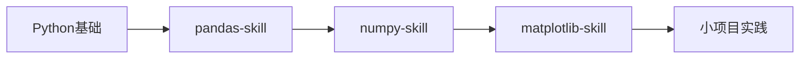

# 🚀 快速开始指南

本指南帮助你快速上手Universal Skills Library,根据不同场景选择合适的技能模块。

## 📋 目录

- [根据角色选择Skills](#根据角色选择skills)
- [根据项目类型选择Skills](#根据项目类型选择skills)
- [学习路径推荐](#学习路径推荐)
- [常见问题](#常见问题)

---

## 🎭 根据角色选择Skills

### 数据分析师

**核心技能**:
1. [pandas-skill](pandas-skill/SKILL.md) - 数据处理基础
2. [numpy-skill](numpy-skill/SKILL.md) - 数值计算
3. [matplotlib-skill](matplotlib-skill/SKILL.md) - 数据可视化
4. [seaborn-skill](seaborn-skill/SKILL.md) - 统计可视化

**进阶技能**:
- [plotly-skill](plotly-skill/SKILL.md) - 交互式可视化
- [jupyter-skill](jupyter-skill/SKILL.md) - 交互式开发
- [polars-skill](polars-skill/SKILL.md) - 高性能数据处理

**学习顺序**: pandas → numpy → matplotlib → seaborn

---

### 机器学习工程师

**基础技能**:
1. [pandas-skill](pandas-skill/SKILL.md) - 数据预处理
2. [numpy-skill](numpy-skill/SKILL.md) - 数值计算
3. [scikit-learn-skill](scikit-learn-skill/SKILL.md) - 传统机器学习

**深度学习**:
1. [pytorch-skill](pytorch-skill/SKILL.md) - 深度学习框架 (推荐)
2. [tensorflow-skill](tensorflow-skill/SKILL.md) - 另一选择

**NLP专项**:
- [huggingface-skill](huggingface-skill/SKILL.md) - Transformer模型
- [spacy-skill](spacy-skill/SKILL.md) - NLP工具
- [transformers-skill](transformers-skill/SKILL.md) - 预训练模型

**部署**:
- [fastapi-skill](fastapi-skill/SKILL.md) - 模型API服务
- [docker-skill](docker-skill/SKILL.md) - 容器化

**学习顺序**: scikit-learn → pytorch → huggingface → fastapi

---

### Web后端开发者

**核心技能**:
1. [fastapi-skill](fastapi-skill/SKILL.md) - 现代API框架 (推荐)
2. [django-skill](django-skill/SKILL.md) - 全栈框架
3. [flask-skill](flask-skill/SKILL.md) - 轻量级框架

**数据相关**:
- [pandas-skill](pandas-skill/SKILL.md) - 数据处理
- [requests-skill](requests-skill/SKILL.md) - HTTP请求
- [beautifulsoup-skill](beautifulsoup-skill/SKILL.md) - 网页解析

**部署**:
- [docker-skill](docker-skill/SKILL.md) - 容器化
- [kubernetes-skill](kubernetes-skill/SKILL.md) - 容器编排

**学习顺序**: fastapi/django → docker → kubernetes

---

### DevOps工程师

**核心技能**:
1. [docker-skill](docker-skill/SKILL.md) - 容器化
2. [kubernetes-skill](kubernetes-skill/SKILL.md) - 容器编排
3. [ansible-skill](ansible-skill/SKILL.md) - 配置管理
4. [terraform-skill](terraform-skill/SKILL.md) - 基础设施即代码

**辅助技能**:
- [pytest-skill](pytest-skill/SKILL.md) - 自动化测试

**学习顺序**: docker → kubernetes → terraform → ansible

---

### AI研究员

**核心技能**:
1. [pytorch-skill](pytorch-skill/SKILL.md) - 深度学习 (首选)
2. [huggingface-skill](huggingface-skill/SKILL.md) - Transformer研究
3. [numpy-skill](numpy-skill/SKILL.md) - 数值计算

**数据处理**:
- [pandas-skill](pandas-skill/SKILL.md) - 数据处理
- [matplotlib-skill](matplotlib-skill/SKILL.md) - 结果可视化

**工具**:
- [jupyter-skill](jupyter-skill/SKILL.md) - 实验环境

**学习顺序**: pytorch → huggingface → jupyter

---

## 🎯 根据项目类型选择Skills

### 项目1: 数据分析报告

**目标**: 分析销售数据并生成可视化报告

**所需Skills**:
```
1. pandas-skill     → 数据清洗和处理
2. matplotlib-skill → 创建静态图表
3. seaborn-skill    → 美化统计图表
4. jupyter-skill    → 生成交互式报告
```

**学习时间**: 2-3周
**难度**: ⭐⭐☆☆☆

---

### 项目2: 情感分析系统

**目标**: 构建评论情感分析API

**所需Skills**:
```
1. pandas-skill       → 数据预处理
2. huggingface-skill  → 使用BERT模型
3. fastapi-skill      → 构建API服务
4. docker-skill       → 容器化部署
```

**学习时间**: 4-6周
**难度**: ⭐⭐⭐☆☆

---

### 项目3: 推荐系统

**目标**: 电商产品推荐系统

**所需Skills**:
```
1. pandas-skill        → 用户行为数据处理
2. scikit-learn-skill  → 协同过滤算法
3. pytorch-skill       → 深度学习推荐
4. fastapi-skill       → API服务
5. docker-skill        → 部署
```

**学习时间**: 6-8周
**难度**: ⭐⭐⭐⭐☆

---

### 项目4: 实时聊天机器人

**目标**: 基于LLM的客服机器人

**所需Skills**:
```
1. huggingface-skill  → GPT模型
2. fastapi-skill      → WebSocket支持
3. docker-skill       → 容器化
4. kubernetes-skill   → 高可用部署
```

**学习时间**: 8-10周
**难度**: ⭐⭐⭐⭐⭐

---

### 项目5: 数据爬虫系统

**目标**: 自动化数据采集平台

**所需Skills**:
```
1. requests-skill        → HTTP请求
2. beautifulsoup-skill   → 网页解析
3. pandas-skill          → 数据存储
4. fastapi-skill         → 管理API
5. docker-skill          → 定时任务容器化
```

**学习时间**: 3-4周
**难度**: ⭐⭐⭐☆☆

---

## 🛤️ 学习路径推荐

### 初学者路径 (0-3个月)



**每周计划**:
- Week 1-2: Python基础复习
- Week 3-4: pandas-skill 完整学习
- Week 5-6: numpy-skill 学习
- Week 7-8: matplotlib-skill 学习
- Week 9-12: 完成3个数据分析小项目

---

### 中级路径 (3-6个月)


**每周计划**:
- Week 1-4: scikit-learn 机器学习基础
- Week 5-8: pytorch 深度学习
- Week 9-12: huggingface NLP
- Week 13-16: fastapi 模型部署
- Week 17-24: 完成2个完整项目

---

### 高级路径 (6-12个月)


**技能组合**:
- 分布式: dask-skill, polars-skill
- 部署: docker-skill, kubernetes-skill
- 自动化: terraform-skill, ansible-skill
- 完整的MLOps流程

---

## ❓ 常见问题

### Q1: 我应该从哪个Skill开始?

**A**: 取决于你的目标:
- **数据分析**: 从 pandas-skill 开始
- **机器学习**: 从 scikit-learn-skill 开始
- **深度学习**: 从 pytorch-skill 开始
- **Web开发**: 从 fastapi-skill 或 django-skill 开始

### Q2: 每个Skill需要学习多久?

**A**: 时间估算:
- **基础Skill** (pandas, numpy): 2-3周
- **框架Skill** (django, fastapi): 3-4周
- **深度学习** (pytorch, tensorflow): 4-6周
- **高级Skill** (kubernetes, huggingface): 4-8周

### Q3: 是否需要按顺序学习?

**A**: 建议的前置技能:
- pytorch-skill → 需要先学 numpy-skill
- huggingface-skill → 需要先学 pytorch-skill
- kubernetes-skill → 需要先学 docker-skill

但大多数Skills可以独立学习!

### Q4: 如何验证学习效果?

**A**: 实践项目清单:
1. 完成每个Skill文档中的所有代码示例
2. 修改示例代码实现自己的需求
3. 完成至少1个综合项目
4. 能够解决"常见问题"部分的所有问题

### Q5: 学习资源不够怎么办?

**A**: 每个Skill文档末尾都有"进阶资源"部分,包括:
- 官方文档链接
- 推荐教程
- 视频课程
- 相关书籍

---

## 📅 学习计划模板

### 4周学习计划示例 (以pandas-skill为例)

**Week 1: 基础**
- Day 1-2: 安装和环境配置
- Day 3-4: DataFrame基础操作
- Day 5-7: 数据选择和过滤

**Week 2: 进阶**
- Day 8-10: 数据清洗和预处理
- Day 11-14: 数据聚合和分组

**Week 3: 高级**
- Day 15-17: 时间序列处理
- Day 18-21: 数据合并和连接

**Week 4: 实践**
- Day 22-24: 完成3个小项目
- Day 25-28: 学习最佳实践和性能优化

---

## 🎓 认证建议

完成以下里程碑可以证明你的技能水平:

**初级** (3个月):
- [ ] 完成5个基础Skill学习
- [ ] 完成10个代码示例修改
- [ ] 完成1个数据分析项目

**中级** (6个月):
- [ ] 完成10个Skill学习
- [ ] 完成3个综合项目
- [ ] 能够独立解决常见问题

**高级** (12个月):
- [ ] 完成15+个Skill学习
- [ ] 完成5个生产级项目
- [ ] 贡献开源项目或创建自己的工具

---

## 📞 获取帮助

遇到问题时:
1. 查看对应Skill的"常见问题"部分
2. 阅读官方文档
3. 在GitHub提Issue
4. 加入社区讨论

---

**祝你学习愉快! 🎉**
